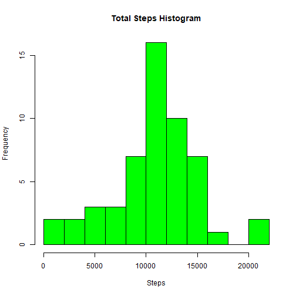
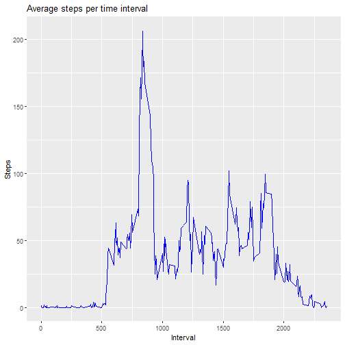
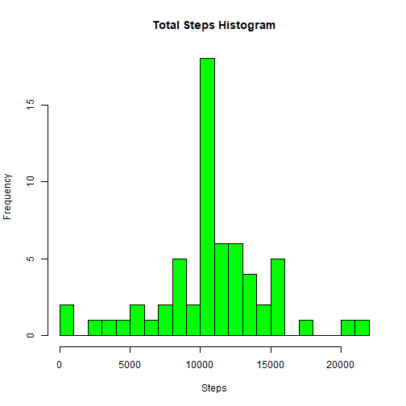
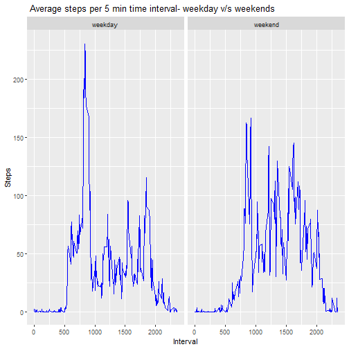

#   Reproducible Research Course Project-Vidushi Bhakat
===============================
## Step 1  
### Code for reading/processing the data set

```r
unzip("repdata_data_activity.zip")
activitydata <- read.csv("activity.csv")
head(activitydata)
```

```
##   steps       date interval
## 1    NA 2012-10-01        0
## 2    NA 2012-10-01        5
## 3    NA 2012-10-01       10
## 4    NA 2012-10-01       15
## 5    NA 2012-10-01       20
## 6    NA 2012-10-01       25
```
## Step 2   
### Histogram of total number of steps taken everyday


```r
aggregateactivity <- tapply(activitydata$steps,activitydata$date,sum)
head(aggregateactivity)
```

```
## 2012-10-01 2012-10-02 2012-10-03 2012-10-04 2012-10-05 2012-10-06 
##         NA        126      11352      12116      13294      15420
```

```r
activitytotal <- data.frame(day.number=1:61,totalactivity=aggregateactivity)
hist(activitytotal$totalactivity,col="green", breaks =15 ,xlab="Steps",ylab="Frequency",main="Total Steps Histogram")
```



## Step 3  
### Mean and median of total steps taken everyday

```r
mean(activitytotal$totalactivity,na.rm=T)
```

```
## [1] 10766.19
```

```r
median(activitytotal$totalactivity,na.rm=T)
```

```
## [1] 10765
```


##  Step 4  
###  Time series plot of average steps taken 
 
 ```r
 library(ggplot2)
 intervalactivity <- aggregate(steps~interval,data=activitydata, mean, na.action=na.omit)
 h <- ggplot(intervalactivity,aes(interval,steps))
 h + geom_line(col="blue")+ggtitle("Average steps per time interval")+
 xlab("Interval") + ylab("Steps")
 ```
 
 


##   Step 5   
###   5 min interval with maximum number of steps
 
 ```r
 library(dplyr)
 intervalactivity %>% select(interval,steps) %>% filter(steps ==max(intervalactivity$steps))
 ```
 
 ```
 ##   interval    steps
 ## 1      835 206.1698
 ```

## Step 6  
### Imputing missing data 
1. Total number of missing values

```r
sum(is.na(activitydata$steps))
```

```
## [1] 2304
```

2. Replacing Missing Values

```r
activitydata$completesteps <- ifelse(is.na(activitydata$steps), round(intervalactivity$steps[match(activitydata$interval, intervalactivity$interval)],0), activitydata$steps)
```

3. New data set with missing values filled in

```r
completeactivity <- data.frame(steps=activitydata$completesteps,interval=activitydata$interval,date=activitydata$date)
head(completeactivity)
```

```
##   steps interval       date
## 1     2        0 2012-10-01
## 2     0        5 2012-10-01
## 3     0       10 2012-10-01
## 4     0       15 2012-10-01
## 5     0       20 2012-10-01
## 6     2       25 2012-10-01
```


## Step 7
### Histogram of daily total steps with missing data filled in

```r
aggregatecompleteactivity <- tapply(completeactivity$steps,completeactivity$date, sum)
hist(aggregatecompleteactivity,col="green",breaks=20,xlab="Steps",ylab="Frequency",main="Total Steps Histogram")
```




### Calculating mean and median of total daily activity 

```r
mean(aggregatecompleteactivity)
```

```
## [1] 10765.64
```

```r
median(aggregatecompleteactivity)
```

```
## [1] 10762
```
Imputing missing data have only a little and transcurable impact on the mean and the median of the total daily number of steps.


## Step 8
### Panel plot comparing the average number of steps taken per 5-minute interval across weekdays and weekends

1.Creating a new factor variable with two levels weekend and weekday

```r
completeactivity$realdate <- as.Date(completeactivity$date, format = "%Y-%m-%d")
completeactivity$weekday <- weekdays(completeactivity$realdate)
completeactivity$daytype <- ifelse(completeactivity$weekday=='Saturday' | completeactivity$weekday=='Sunday', 'weekend','weekday')
head(completeactivity)
```

```
##   steps interval       date   realdate weekday daytype
## 1     2        0 2012-10-01 2012-10-01  Monday weekday
## 2     0        5 2012-10-01 2012-10-01  Monday weekday
## 3     0       10 2012-10-01 2012-10-01  Monday weekday
## 4     0       15 2012-10-01 2012-10-01  Monday weekday
## 5     0       20 2012-10-01 2012-10-01  Monday weekday
## 6     2       25 2012-10-01 2012-10-01  Monday weekday
```

2. 5 min time series plot

```r
intervalactivityDT <- aggregate(steps~interval+daytype,data=completeactivity, FUN=mean, na.action=na.omit)
j <- ggplot(intervalactivityDT,aes(interval,steps))
j +  geom_line(col="blue") + facet_grid(.~daytype) + ggtitle(" Average steps per 5 min time interval- weekday v/s weekends") + xlab("Interval") + ylab("Steps")
```



 
 
 
 
 
